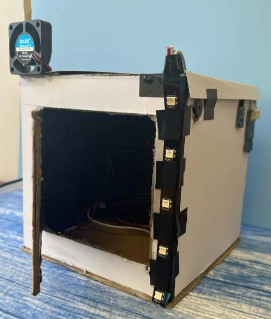
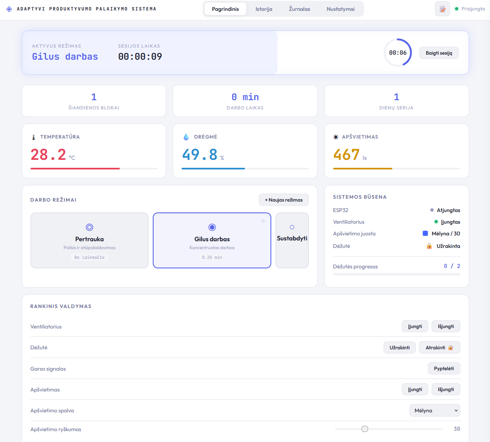
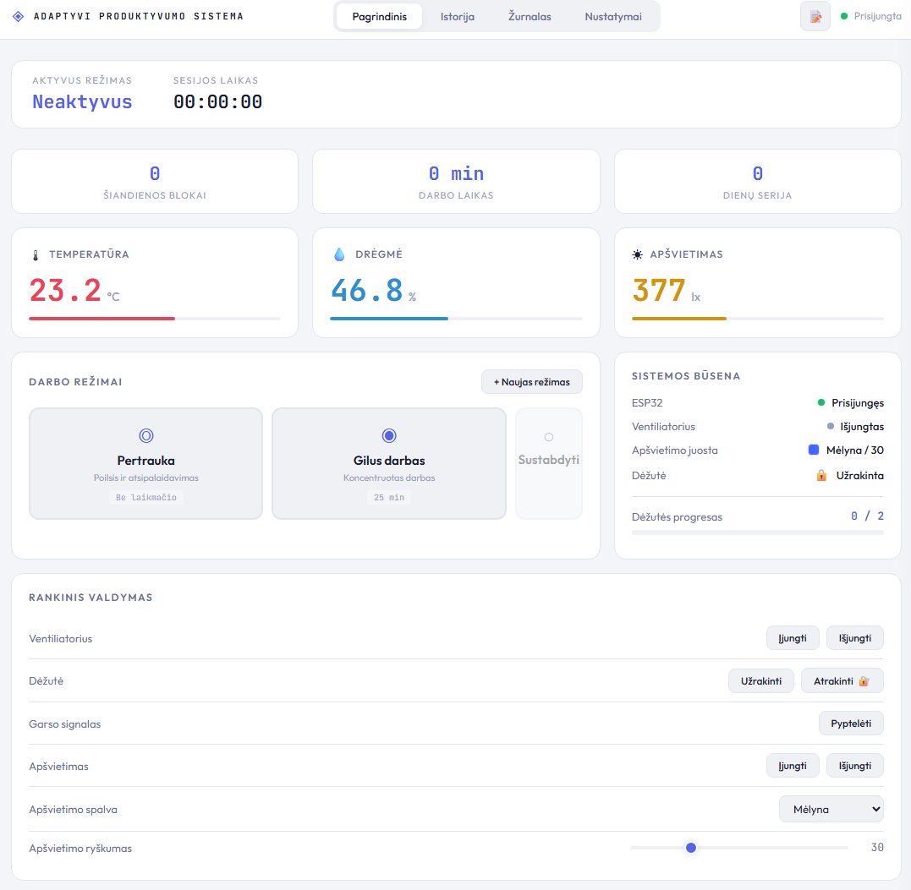
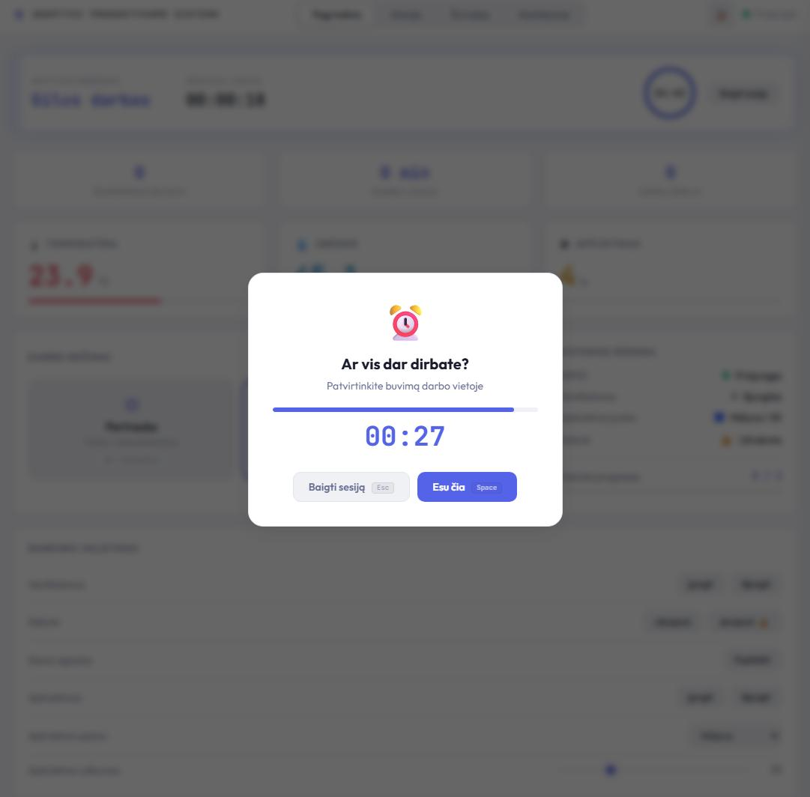
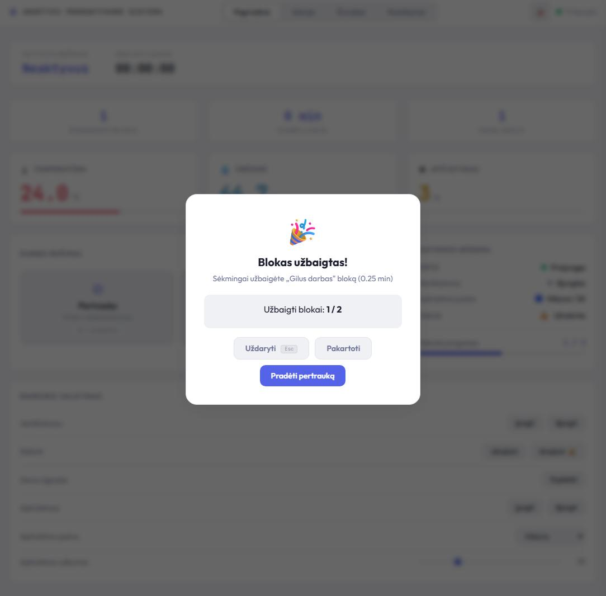
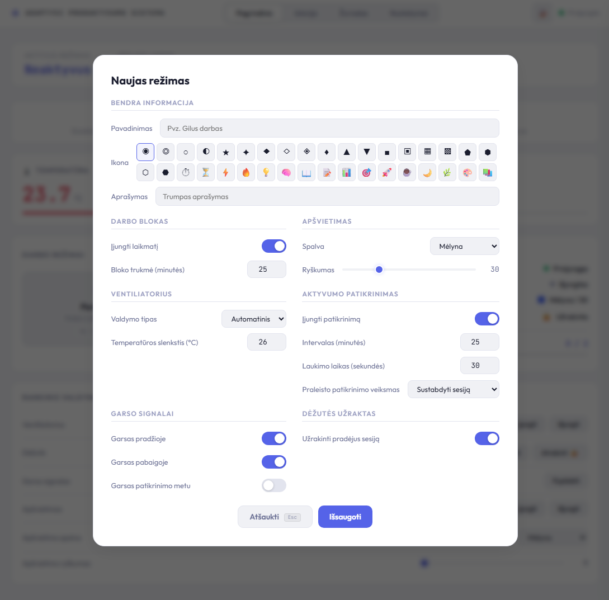
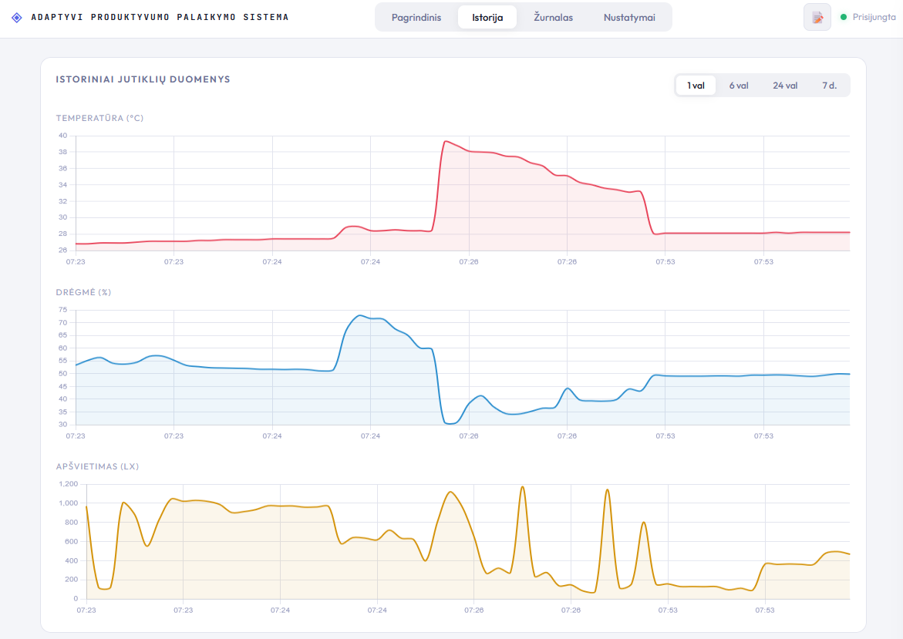
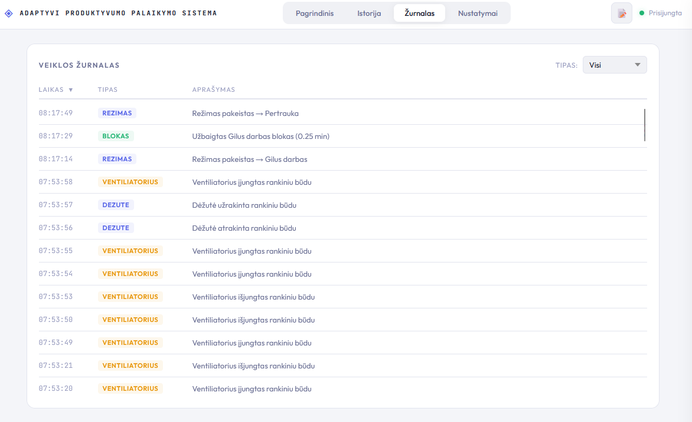
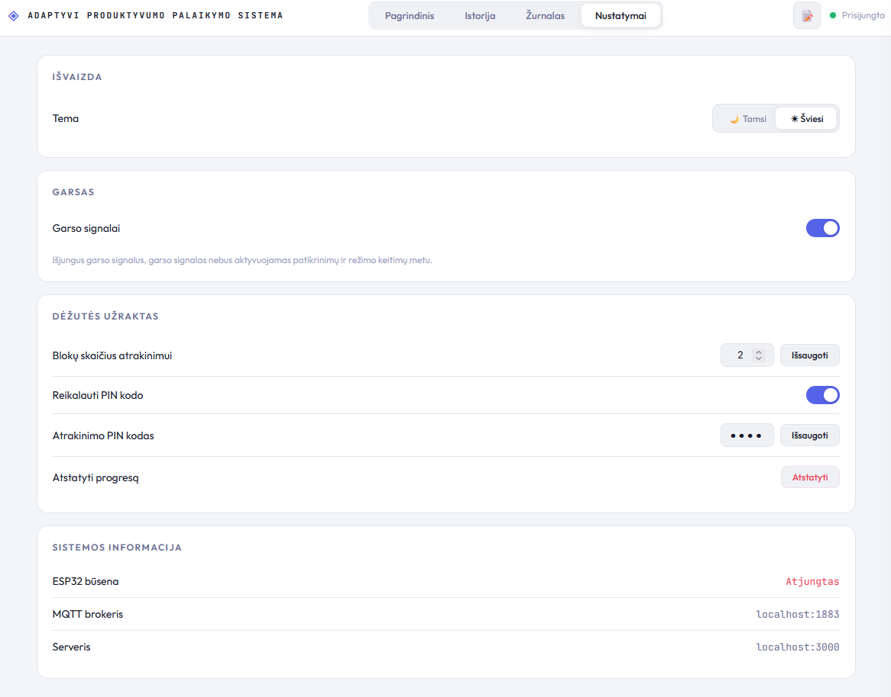
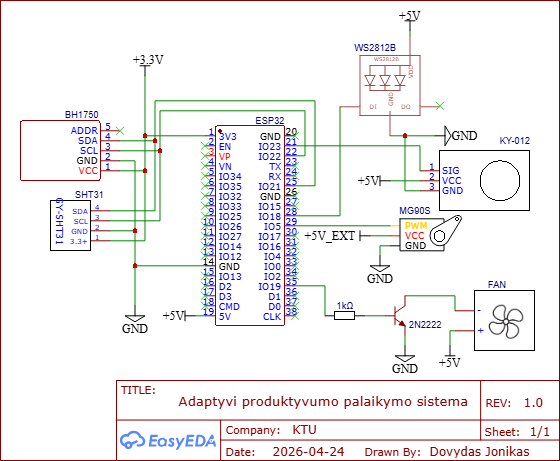

<h1 align="center">Adaptive Productivity System</h1>

<p align="center">A desk that reacts to you. Sensors read the room, an ESP32 drives the light, the fan and a locked box, and a web dashboard turns a work session into something you can see.</p>

<p align="center">
  <a href="LICENSE"></a>
  
  
  
  
</p>

<p align="center"><sub>Bachelor's thesis - Kaunas University of Technology, Faculty of Informatics, 2026</sub></p>

<p align="center">
  
  &nbsp;&nbsp;
  
</p>

## The idea

Most productivity tools are a screen telling you what you should be doing. This one is a room that
changes around you instead.

You pick a work mode. The LED shifts colour, the fan decides for itself whether the air needs
moving, a timer starts. Partway through, the system asks you to confirm you are still at the desk.
Finish enough focus blocks and a servo physically unlocks a box you put something in before you
started.

The box is the whole point: **a consequence you can touch beats a notification you can dismiss.**

## How it works

<p align="center"></p>

Three pieces, two protocols. HTTP carries intent, MQTT carries hardware, WebSocket carries anything
the screen has to show the moment it happens.

**ESP32.** Reads temperature and humidity (SHT31) and light (BH1750) every two seconds, publishes
every three. Drives the LED, fan, buzzer and servo.

If the WiFi or the broker drops, it keeps running on its own - the fan still reacts to temperature,
the LED holds the current mode. Losing the server degrades the system rather than stopping it.

**Node server.** Subscribes to the sensor topic, writes each reading to SQLite, pushes it straight
to the browser over a WebSocket. Commands travel the other way: dashboard hits a REST endpoint,
server publishes MQTT, device acts.

**Dashboard.** Vanilla JS. Live values, charts, mode editor, check-in modal, event log, box
progress. No framework, no build step.

<table>
  <tr>
    <td align="center"><br><sub><b>Use cases</b> - what the person does, and what the timer does without them</sub></td>
    <td align="center"><br><sub><b>Check-in flow</b> - confirmed, late, missed and dismissed all end differently</sub></td>
  </tr>
</table>

## The dashboard

<table>
  <tr>
    <td align="center"><br><sub><b>Main view</b><br>live sensors, modes, manual control</sub></td>
    <td align="center"><br><sub><b>Check-in</b><br>confirm you are still here, or the block breaks</sub></td>
    <td align="center"><br><sub><b>Block complete</b><br>the box moves one step closer to open</sub></td>
  </tr>
  <tr>
    <td align="center"><br><sub><b>Mode editor</b><br>every decision a block needs, saved once</sub></td>
    <td align="center"><br><sub><b>History</b><br>sensor readings over time</sub></td>
    <td align="center"><br><sub><b>Event log</b><br>what the system did and when</sub></td>
  </tr>
  <tr>
    <td align="center" colspan="3"><br><sub><b>Settings</b><br>box target, theme, sound</sub></td>
  </tr>
</table>

## Modes

A mode is a saved set of decisions, so a work block starts without any.

Each one holds its LED colour and brightness, whether the fan runs automatic or manual and at what
temperature, the timer length, whether check-ins run and how often, which events get a buzzer, what
happens on a missed check-in, and whether the box locks when the block begins.

Ships with **Focus**, **Break** and idle. New ones are made in the dashboard, not in the code.

## Hardware

| Component | Job |
|---|---|
| ESP32 | Everything on the device side |
| SHT31 | Temperature and humidity, I2C |
| BH1750 | Ambient light, I2C |
| WS2812B | Mode colour, brightness capped at 30 for USB power |
| MG90S servo | The box latch |
| 5V fan + 2N2222 | Air, switched by the microcontroller |
| KY-012 buzzer | Check-in prompts and block boundaries |

<details>
<summary><b>Circuit schematic</b></summary>
<br>
<p align="center"></p>
</details>

## Quick start

Needs Node 18+ and an MQTT broker on the same machine.

```bash
git clone https://github.com/Quicasha/adaptive-productivity-system.git
cd adaptive-productivity-system
npm install
npm start
```

Dashboard is on `http://localhost:3000`. SQLite builds itself on first run with the default modes
in it.

**It runs with no hardware attached** - sensor values stay empty, everything else works. Fastest way
to see what the system does.

Broker, wiring and firmware: **[docs/SETUP.md](docs/SETUP.md)**

## Structure

```
firmware/     ESP32 firmware and the secrets template
index.js      server entry - wires the modules together
config/       SQLite schema and default modes
mqtt/         broker client, sensor ingest, command publishing
websocket/    push channel to the browser
services/     state, sensor data, modes, sessions
routes/       REST API for the dashboard
public/       the dashboard itself
docs/         setup guide and diagrams
```

<table>
  <tr>
    <td align="center"><br><sub><b>Firmware</b></sub></td>
    <td align="center"><br><sub><b>Frontend</b></sub></td>
  </tr>
</table>

## What I would do differently

**The broker address and server port are hardcoded.** Fine for one desk, wrong for anything else.
Both belong in a config file, the way the WiFi credentials now do.

**No automated tests.** Verified by running it, which works right up until it does not. The services
layer is pure enough to test properly and should have been.

**Reconnection is too simple.** The ESP32 retries every five seconds forever. A real device would
back off, and would tell the server how long it was gone instead of silently resuming.

**The client talks two ways** - REST for commands, WebSocket for state. I would keep the split, but
route both through one module instead of spreading it across `app.js`.

## Notes

Code comments are in Lithuanian, matching the thesis they were written for. Deliberate - this is the
project as submitted, not a rewrite.

Released under the [MIT License](LICENSE).
