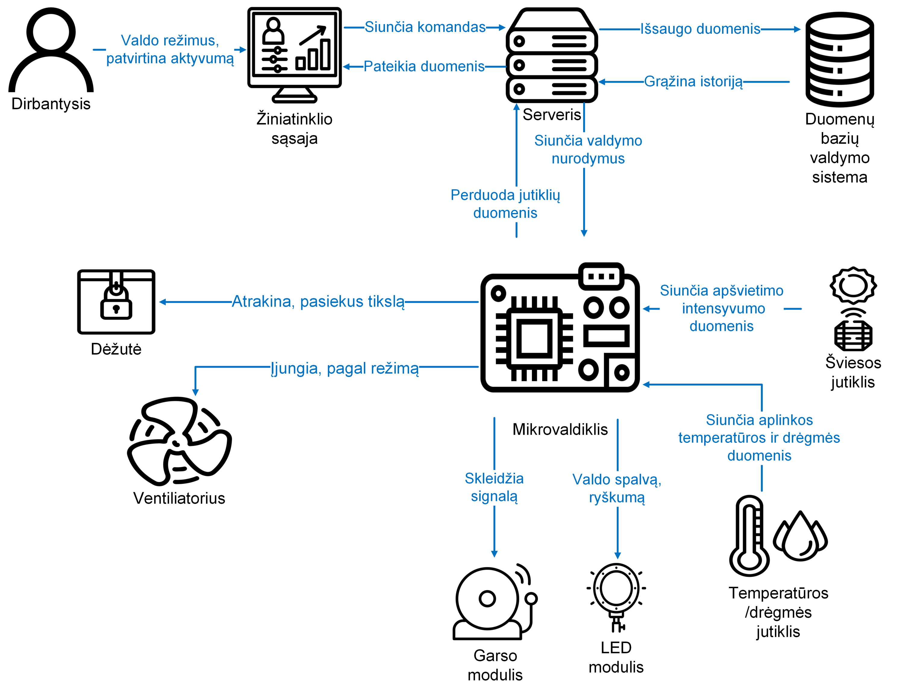
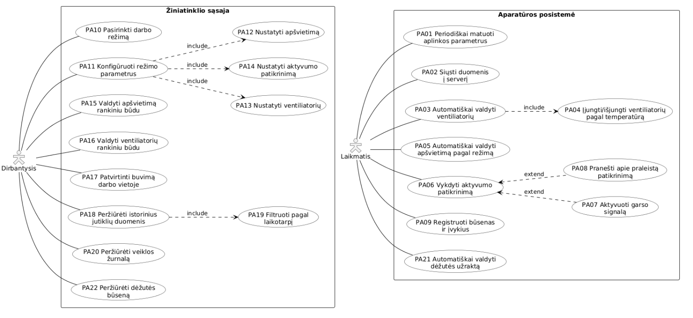
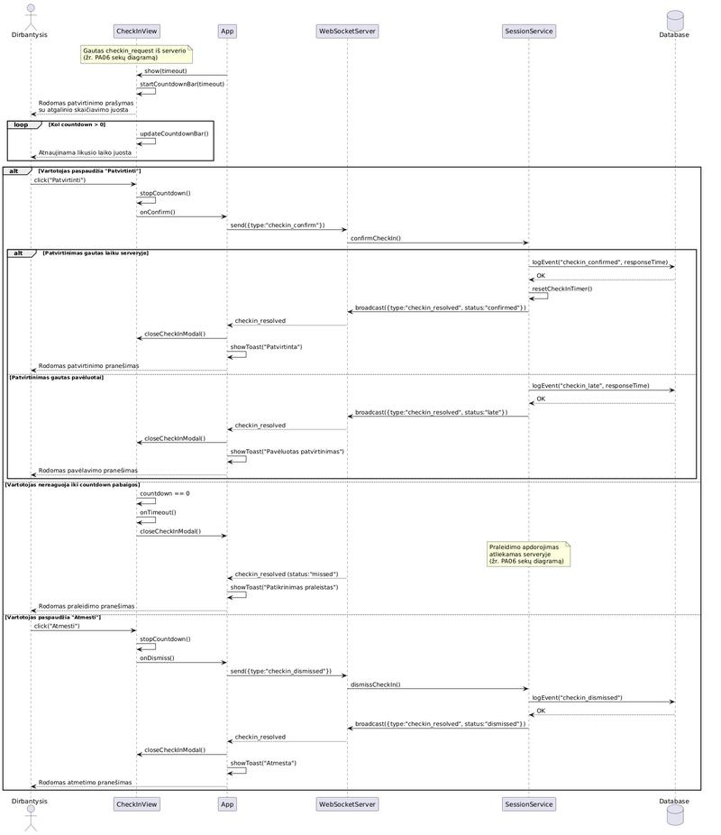
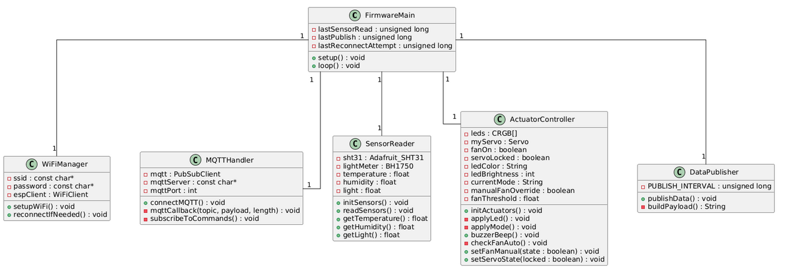
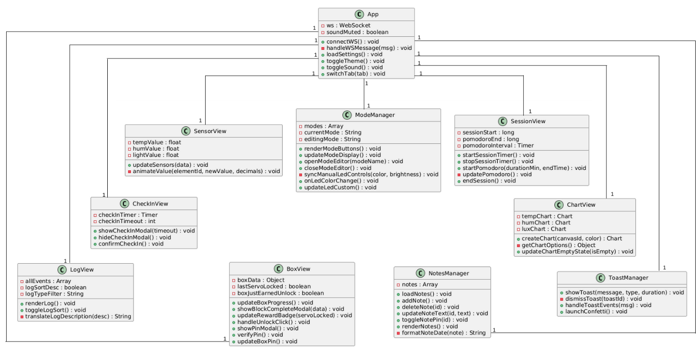

<h1 align="center">Adaptive Productivity System</h1>

<p align="center">A desk that reacts to you. Sensors read the room, an ESP32 drives the light, the fan and a locked box, and a web dashboard turns a work session into something you can see.</p>

<p align="center"><sub>Bachelor's thesis project - Kaunas University of Technology, Faculty of Informatics, 2026</sub></p>

<p align="center">
  <a href="LICENSE"></a>
  
  
  
  
</p>

---

## The idea

Most productivity tools are a screen telling you what you should be doing. This one is a room that
changes around you instead.

You pick a work mode. The LED shifts colour, the fan decides for itself whether the air needs
moving, and a timer starts. Partway through, the system asks you to confirm you are still at the
desk - if you do not answer, it registers a missed check-in. Finish enough focus blocks and a servo
physically unlocks a box you put something in before you started.

The point of the box is the point of the whole project: **a consequence you can touch beats a
notification you can dismiss.**

---

## How it works

<p align="center"></p>

Three pieces, talking over two protocols.

**The ESP32** reads temperature and humidity (SHT31) and light level (BH1750) every two seconds, and
publishes them over MQTT every three. It drives a WS2812B LED, a fan through a 2N2222 transistor, a
passive buzzer and an MG90S servo. If the WiFi or the broker disappears, **it keeps running on its
own** - the fan still reacts to temperature, the LED keeps the current mode's colour. Losing the
server degrades the system, it does not stop it.

**The Node server** subscribes to the sensor topic, writes every reading into SQLite, and pushes it
straight out to the browser over a WebSocket. Commands go the other way: the dashboard hits a REST
endpoint, the server publishes an MQTT command, the ESP32 acts on it. HTTP for intent, MQTT for
hardware, WebSocket for anything the UI has to see the moment it happens.

**The dashboard** is vanilla JS - live sensor values, charts, the mode editor, the check-in modal,
an event log and the box progress. No framework, no build step.

<table>
  <tr>
    <td align="center"><br><sub><b>Use cases</b> - what the person does, and what the timer does without them</sub></td>
    <td align="center"><br><sub><b>The check-in flow</b> - confirmed, late, missed and dismissed all end differently</sub></td>
  </tr>
</table>

---

## Modes

A mode is a saved set of decisions, so a work block starts without any. Each one carries its LED
colour and brightness, whether the fan is automatic or manual and at what temperature it kicks in,
the timer length, whether check-ins run and how often, which events get a buzzer, what happens when
a check-in is missed, and whether the box locks when the block begins.

The system ships with **Focus**, **Break** and an idle state, and new modes are created from the
dashboard rather than the code.

---

## The parts

| Component | Job |
|---|---|
| ESP32 | Everything on the hardware side |
| SHT31 | Temperature and humidity, over I2C |
| BH1750 | Ambient light, over I2C |
| WS2812B | Mode colour, brightness capped at 30 for USB power |
| MG90S servo | The box latch |
| 5V fan + 2N2222 | Air, switched by the microcontroller |
| KY-012 buzzer | Check-in prompts and block boundaries |

---

## Running it

You need Node 18 or newer and an MQTT broker on the same machine. Mosquitto is what this was built
against.

```bash
git clone https://github.com/Quicasha/adaptive-productivity-system.git
cd adaptive-productivity-system
npm install
node index.js
```

The dashboard is then on `http://localhost:3000`. SQLite creates itself on first run, with the
default modes already in it. It runs with no hardware attached - sensor values stay empty, but
modes, the timer, check-ins and the log all work.

Full walkthrough including the broker, the wiring and the firmware: **[docs/SETUP.md](docs/SETUP.md)**.

For the firmware, copy the secrets template and fill in your own network:

```bash
cp firmware/secrets.example.h firmware/secrets.h
```

Then open `firmware/firmware.ino` in the Arduino IDE, install `PubSubClient`, `BH1750`,
`Adafruit_SHT31`, `FastLED` and `ESP32Servo`, and flash an ESP32 board. `secrets.h` is gitignored,
so credentials never end up in a commit.

---

## Structure

```
firmware/          ESP32 firmware and the secrets template
index.js           server entry - wires the modules together
config/            SQLite schema and default modes
mqtt/              broker client, sensor ingest, command publishing
websocket/         push channel to the browser
services/          state, sensor data, modes, sessions
routes/            REST API for the dashboard
public/            the dashboard itself
docs/images/       diagrams from the thesis
```

<table>
  <tr>
    <td align="center"><br><sub><b>Firmware</b></sub></td>
    <td align="center"><br><sub><b>Frontend</b></sub></td>
  </tr>
</table>

---

## What I would do differently

**The MQTT broker address and the server port are hardcoded.** Fine for a prototype on one desk,
wrong for anything else. Both belong in a config file the way the WiFi credentials now are.

**There are no automated tests.** The whole thing was verified by running it, which works right up
until it does not. The services layer is pure enough to test properly and should have been.

**The dashboard talks to the server two different ways** - REST for commands, WebSocket for state.
That split is deliberate and I would keep it, but the client code would be cleaner if both went
through one module instead of being spread across `app.js`.

**Reconnection is simpler than it should be.** The ESP32 retries every five seconds forever. A real
device would back off, and would tell the server how long it was gone rather than silently resuming.

---

## Notes

Code comments are in Lithuanian, matching the thesis they were written for. That was deliberate -
this is the project as submitted, not a rewrite.

The full thesis and the defence presentation are available through
[KTU eLABa](https://www.elaba.lt/) under the title *Adaptyvi produktyvumo palaikymo sistema*.

Supervisor: prof. dr. Egidijus Kazanavičius. Reviewer: asist. dr. Rolandas Girčys.

---

## License

MIT - see [LICENSE](LICENSE).
